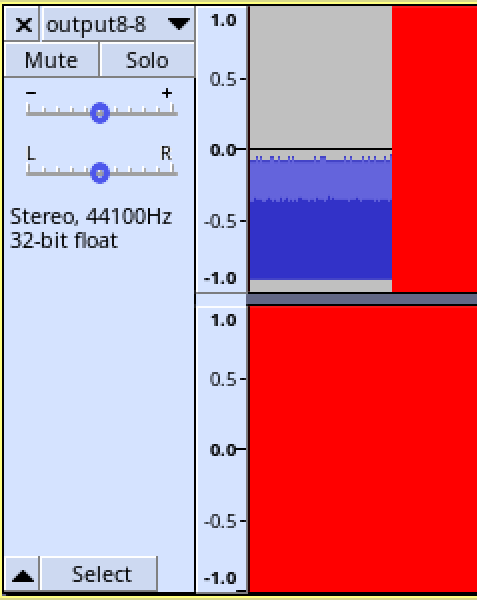

# Steganography into .wav files

This project was done for CSCE-463 'Data & Network Security' at University of Nebraska - Linclon in Spring of 2021 by Vega Carlson and Noah McCashland.

Along with the code, input files, and results, this reposistory also contains the slides from the presentation that was given as well as the paper. Those can be found at [LSB__Wave_Steganography.pdf](LSB__Wave_Steganography.pdf) and [SteganographySlides.pdf](SteganographySlides.pdf) respectively. Pelase note that the .pdf export of the slides contain audio playback buttons that will not function. See the audio files in this repository for those results.


This code is very proof of concept in nature, and as such, assumes the user is willing to fidle with the code. File path and setting variables are hard coded in on lines 13-15 of `encoder.py`

```py
input_wav = 'lemons8.wav'
input_data = 'input.txt'
num_bits = 1
```

Similarly, the output file destinations are hardcoded on lines 110-115 of `encoder.py`:

```py
if type(wav[0,0]) is np.int32:
    sf.write("output24-1.wav", wav, samplerate, 'PCM_24')
elif type(wav[0,0]) is np.int16:
    sf.write("output16-1.wav", wav, samplerate, 'PCM_16')
elif type(wav[0,0]) is np.uint8:
    wavfile.write("output8-1.wav", samplerate, wav)
```

Finally, the decoder's input file path is stored on line 8 of `decoder.py`

```py
input_wav = 'output24-8.wav'
```

The code assumes a stereo wav file but the right channel is currently unused. There are no checks for if the input data (.txt here, but anything should work) will actually fit inside of the .wav given the number of bits.

The decoder is limited to an arbitary length in printing to avoid extremely long output; however, the full data should be encoded correctly.

Also, some less than reasonable settings are possible, like storing 8 bits into an 8-bit wav, which looks about like you'd expect:



Here's the input 8-bit wav file:


here's the output at 4, 2, and 1 bits used to hold the 'secret' data respcetively:


on a 24 bit wavefrom, even with 8 bits holding the secret data, the effect is inaudible and all but impossible to see in the waveform, here's the input 24-bit wav and the output at 8-bit reserved respectively:


---

Audio used in demo is stolen from the video game 'Portal 2' made by Valve, and is used without permission under the hope that nobody cares- it was downloaded from https://i1.theportalwiki.net/img/a/af/Cave_Johnson_eighties_outro09.wav

---

MIT LICENSE

All source code '.py' files Copyright 2021 Vega Carlson, Noah McCashland.

Permission is hereby granted, free of charge, to any person obtaining a copy of this software and associated documentation files (the "Software"), to deal in the Software without restriction, including without limitation the rights to use, copy, modify, merge, publish, distribute, sublicense, and/or sell copies of the Software, and to permit persons to whom the Software is furnished to do so, subject to the following conditions:

The above copyright notice and this permission notice shall be included in all copies or substantial portions of the Software.

THE SOFTWARE IS PROVIDED "AS IS", WITHOUT WARRANTY OF ANY KIND, EXPRESS OR IMPLIED, INCLUDING BUT NOT LIMITED TO THE WARRANTIES OF MERCHANTABILITY, FITNESS FOR A PARTICULAR PURPOSE AND NONINFRINGEMENT. IN NO EVENT SHALL THE AUTHORS OR COPYRIGHT HOLDERS BE LIABLE FOR ANY CLAIM, DAMAGES OR OTHER LIABILITY, WHETHER IN AN ACTION OF CONTRACT, TORT OR OTHERWISE, ARISING FROM, OUT OF OR IN CONNECTION WITH THE SOFTWARE OR THE USE OR OTHER DEALINGS IN THE SOFTWARE.

---

As an aside, this project was developed pretty rapidly for this class. I wouldn't actually recomend using it to hide files, though the code should serve as a good starting point for something that would- if you actually wanted to do this, you'd probably want to distribute the 'sceret' bytes to conincide with the highest amplitude peaks of the wav, add code for encoding the original data's length into the output wav and where those peaks are. Plus, depending on your use case, make the decoder actually output the original file, not just ASCII. If you want to write even remotely large files, you'd probably need to allow for storage into the right channel as well.

Basically, along with the MIT LICENSE's claim to lack of liability, I'm also just letting you know you shouldn't actually use this for real security. Not that you really should need to anyway? Like, far as I can tell, outside of avoiding oppressive goverments, Steganography is really used mostly for hiding illegal content that honestly I hope you get caught if you have. The only good use for it is really artistic in nature, if you're a musician and want to use this to hide some discount code to your discography or something that'd actually be pretty cool. Otherwise, just AES your stuff and don't be a moron, and that's 1000x more secure than this, albeit more obvious ╮(─▽─)╭